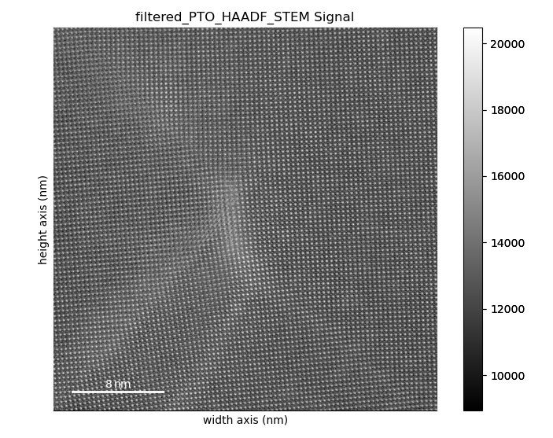
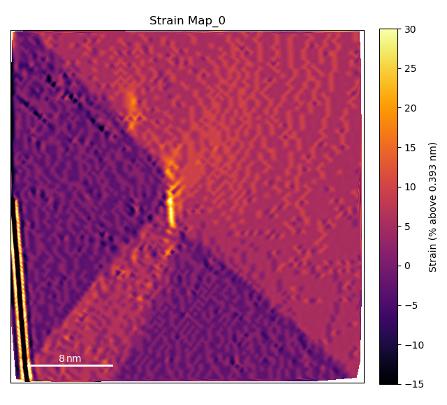
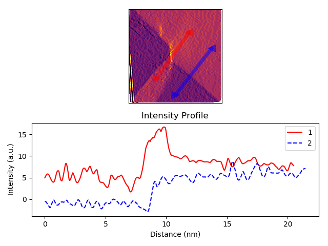
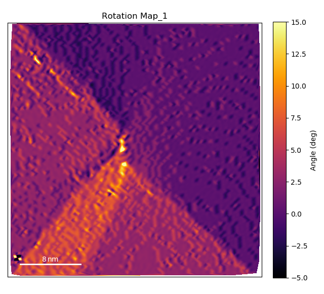
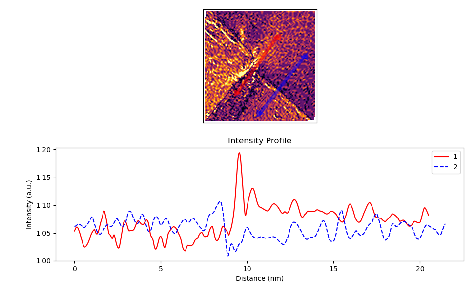
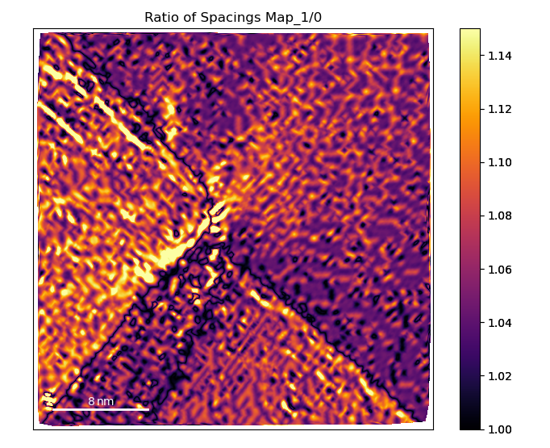

.. _PTO-Junction_kalani_publication:

.. include:: define_roles.rst

************************************
Analysis of PTO Domain Wall Junction
************************************

This tutorial follows the python scripts and jupyter notebooks found in the
"TEMUL/publication_examples/PTO-Junction_kalani_moore" folder in the
`TEMUL repository <https://github.com/PinkShnack/TEMUL>`_. The data and scripts
used below can be downloaded from there.

Import the Modules and Load the Data
------------------------------------

.. code-block:: python

    >>> import temul.polarisation as tmlp
    >>> from temul.signal_plotting import compare_images_line_profile_one_image
    >>> import atomap.api as am
    >>> import hyperspy.api as hs
    >>> import numpy as np
    >>> import os
    >>> path_to_data = os.path.join(os.path.abspath(''), "publication_examples/PTO-Junction_kalani_moore/data") 
    >>> os.chdir(path_to_data)

# Open the filtered PTO Junction dataset

.. code-block:: python

    >>> image = hs.load('filtered_PTO_HAADF_STEM.hspy')
    >>> sampling = image.axes_manager[-1].scale  # nm/pix
    >>> units = image.axes_manager[-1].units
    >>> image.plot()

Open the pre-made PTO-SRO atom lattice.

.. code-block:: python

    >>> atom_lattice = am.load_atom_lattice_from_hdf5("Atom_Lattice_crop.hdf5", False)
    >>> sublattice1 = atom_lattice.sublattice_list[0]  # Pb Sublattice
    >>> sublattice2 = atom_lattice.sublattice_list[1]  # Ti Sublattice
    >>> sublattice1.construct_zone_axes(atom_plane_tolerance=1)

Set up the Parameters
---------------------

Set up parameters for plotting the strain, rotation, and c/a ratio maps:
Note that sometimes the 0 and 1 axes are constructed first or second,
so you may have to swap them.

.. code-block:: python

    >>> zone_vector_index_A = 0
    >>> zone_vector_index_B = 1
    >>> filename = None  # Set to a string if you want to save the map

Note: You can use :python:`return_x_y_z=True` for each of the map functions below
to get the raw x,y, and strain/rotation/ratio values for further plotting with
matplotlib! `Check the documentation <temul-toolkit.readthedocs.io>`_

Load the line profile positions:

.. code-block:: python

    >>> line_profile_positions = np.load('line_profile_positions.npy')

Note: You can also choose your own line_profile_positions with
:python:`am.add_atoms_with_gui(image)` and use the :python:`skimage.profile_line`
for customisability.

Create the Lattice Strain Map
-----------------------------

We want to see the strain map of the Pb Sublattice in the y-axis direction
Note that sometimes the 0 and 1 axes directions are constructed vice versa.

.. code-block:: python

    >>> vmin = -15
    >>> vmax = 30
    >>> cmap = 'inferno'
    >>> theoretical_value = round(3.929/10, 3)  # units of nm
    >>> strain_map = tmlp.get_strain_map(sublattice1, zone_vector_index_B,
    ...                          theoretical_value, sampling=sampling,
    ...                          units=units, vmin=vmin, vmax=vmax, cmap=cmap)

Plot the line profiles with :python:`temul.signal_plotting` functions and a kwarg dictionary

.. code-block:: python

    >>> kwargs = {'vmin': vmin, 'vmax': vmax, 'cmap': cmap}
    >>> compare_images_line_profile_one_image(strain_map, line_profile_positions,
    ...                               linewidth=100, arrow='h', linetrace=0.05,
    ...                               **kwargs)

Create the Lattice Rotation Map
-------------------------------

Now plot the rotation map of the Pb Sublattice in the x-axis direction to see
the turning of the lattice across the junction.

.. code-block:: python

    >>> vmin = -5
    >>> vmax = 15
    >>> cmap = 'inferno'
    >>> angle_offset = -2  # degrees
    >>> rotation_map = tmlp.rotation_of_atom_planes(
    >>>                     sublattice1, zone_vector_index_A, units=units,
    >>>                     angle_offset, degrees=True, sampling=sampling,
    >>>                     vmin=vmin, vmax=vmax, cmap=cmap)

Plot the line profiles with :python:`temul.signal_plotting` functions and a kwarg dictionary

.. code-block:: python

    >>> kwargs = {'vmin': vmin, 'vmax': vmax, 'cmap': cmap}
    >>> compare_images_line_profile_one_image(rotation_map, line_profile_positions,
    >>>                                linewidth=100, arrow='h', linetrace=0.05,
    >>>                                **kwargs)

Create the Lattice Rotation Map
-------------------------------

Now plot the c/a ratio map of the Pb Sublattice

.. code-block:: python

    >>> vmin = 1
    >>> vmax = 1.15
    >>> cmap = 'inferno'
    >>> ideal_ratio_one = True  # values under 1 will be divided by themselves
    >>> ca_ratio_map = tmlp.ratio_of_lattice_spacings(
    >>>                    sublattice1, zone_vector_index_B,
    >>>                    zone_vector_index_A, ideal_ratio_one, sampling=sampling,
    >>>                    units=units, vmin=vmin, vmax=vmax, cmap=cmap)

.. code-block:: python

    >>> kwargs = {'vmin': vmin, 'vmax': vmax, 'cmap': cmap}
    >>> compare_images_line_profile_one_image(ca_ratio_map, line_profile_positions,
    >>>                               linewidth=100, arrow='h', linetrace=0.05,
    >>>                               **kwargs)

