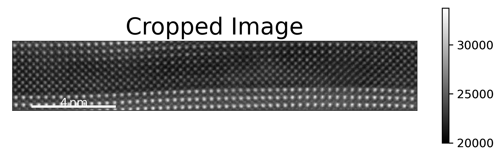
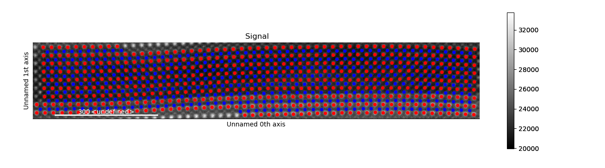
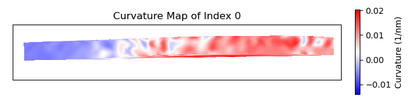

.. _PTO_supercrystal_hadjimichael:

.. include:: define_roles.rst

===================================
Calculation of Atom Plane Curvature
===================================

This tutorial follows the python scripts and jupyter notebooks found in the
"publication_examples/PTO_supercrystal_hadjimichael" folder in the
`TEMUL repository <https://github.com/PinkShnack/TEMUL>`_. The data and scripts
used below can be downloaded from there. You can also interact with the data
without needing any downloads. Just click this button and navigate to that same folder,
where you will find the python scripts and interactive python notebooks:

.. image:: https://mybinder.org/badge_logo.svg
    :target: https://mybinder.org/v2/gh/PinkShnack/TEMUL/master

The :python:`calculate_atom_plane_curvature` function has been adapted from the
MATLAB script written by Dr. Marios Hadjimichael for the publication
M. Hadjimichael, Y. Li *et al*, `Metal-ferroelectric supercrystals with periodically
curved metallic layers, Nature Materials 2020 <https://www.nature.com/articles/s41563-020-00864-6>`_.
This MATLAB script can also be found in the same folder.

The :python:`calculate_atom_plane_curvature` function in the
:python:`temul.lattice_structure_tools` module can be used to find the curvature of the
displacement of atoms along an atom plane in a sublattice. Using the default
parameter :python:`func='strain_grad'`, the function will approximate the
curvature as the strain gradient, as in cases where the first derivative is
negligible. See "Landau and Lifshitz, Theory of Elasticity, Vol 7, pp 47-49, 1981"
for more details. One can use any :python:`func` input that can be used by
:python:`scipy.optimize.curve_fit`.

Import the Modules and Load the Data
------------------------------------

.. code-block:: python

    >>> import temul.api as tml
    >>> import atomap.api as am
    >>> import hyperspy.api as hs
    >>> import os
    >>> path_to_data = os.path.join(os.path.abspath(''),
    ...             "publication_examples/PTO_supercrystal_hadjimichael/data") 
    >>> os.chdir(path_to_data)

Open the PTO/SRO dataset

.. code-block:: python

    >>> image = hs.load('Cropped_PTO-SRO_Aligned.hspy')
    >>> sampling = image.axes_manager[-1].scale #  nm/pix
    >>> units = image.axes_manager[-1].units
    >>> image.plot()

Open the pre-made PTO-SRO atom lattice.

.. code-block:: python

    >>> atom_lattice = am.load_atom_lattice_from_hdf5("Atom_Lattice_crop.hdf5")
    >>> sublattice1 = atom_lattice.sublattice_list[0] #  Pb-Sr Sublattice
    >>> sublattice2 = atom_lattice.sublattice_list[1] #  Ti-Ru Sublattice
    >>> atom_lattice.plot()

Set up the Parameters
---------------------

Plot the sublattice planes to see which :python:`zone_vector_index` we use

.. code-block:: python

    >>> sublattice2.construct_zone_axes(atom_plane_tolerance=1)
    >>> # sublattice2.plot_planes()

Set up parameters for :python:`calculate_atom_plane_curvature`

.. code-block:: python

    >>> zone_vector_index = 0
    >>> atom_planes = (2, 6) #  chooses the starting and ending atom planes
    >>> vmin, vmax = 1, 2
    >>> cmap = 'bwr' #  see matplotlib and colorcet for more colormaps
    >>> title = 'Curvature Map'
    >>> filename = None #  Set to a string if you want to save the map

Set the extra initial fitting parameters

.. code-block:: python

    >>> p0 = [14, 10, 24, 173]
    >>> kwargs = {'p0': p0, 'maxfev': 1000}

Calculate the Curvature of Atom Planes
--------------------------------------

We want to see the curvature in the SRO Sublattice

.. code-block:: python

    >>> curvature_map = tml.calculate_atom_plane_curvature(sublattice2, zone_vector_index,
    ...                     sampling=sampling, units=units, cmap=cmap, title=title,
    ...                     atom_planes=atom_planes, **kwargs)

When using :python:`plot_and_return_fits=True`, the function will return the curve
fittings, and plot each plane (plots not displayed).

.. code-block:: python

    >>> curvature_map, fittings = tml.calculate_atom_plane_curvature(sublattice2,
    ...                     zone_vector_index, sampling=sampling, units=units,
    ...                     cmap=cmap, title=title, atom_planes=atom_planes, **kwargs,
    ...                     plot_and_return_fits=True)
