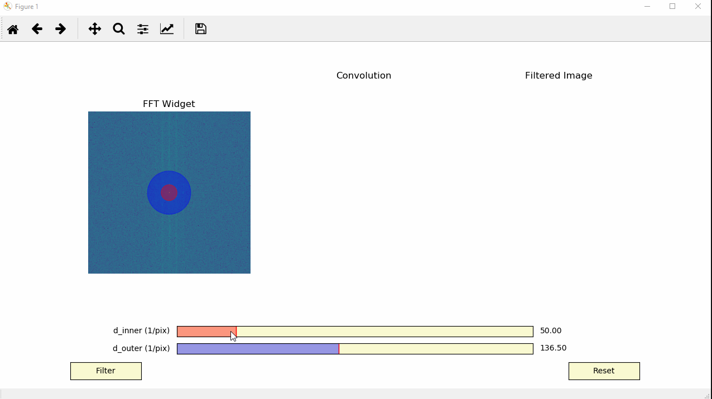

.. _dg_visualiser_tutorial:

.. include:: define_roles.rst

===========================
Interactive Image Filtering
===========================

The :python:`temul.signal_processing` module allows one to filter images with a
double Gaussian (band-pass) filter. Apart from the base functions, it can be
done interactively with the :python:`visualise_dg_filter` function. In this
tutorial, we will see how to use the function on experimental data.

Load the Experimental Image
---------------------------

Here we load an example experimental atomic resolution image stored in the
TEMUL package.

.. code-block:: python

    >>> import temul.signal_processing as tmlsig
    >>> from temul.example_data import load_Se_implanted_MoS2_data
    >>> s = load_Se_implanted_MoS2_data()

Filter the Experimental Image
-----------------------------

Run the :python:`visualise_dg_filter` function. There are lots of other parameters
too for customisation.

.. code-block:: python

    >>> tmlsig.visualise_dg_filter(s)

As we can see, an interactive window appears, showing the FFT ("FFT Widget") of the image with
the positions of the inner and outer Gaussian full width at half maximums (FWHMs).
The inital FWHMs can be changed with the :python:`d_inner` and :python:`d_outer`
parameters (limits can also be changed).

To change the two FWHMs interactively
just use the sliders at the bottom of the window. Reset can be used to reset the
FWHMs to their initial value, and Filter will display the "Convolution" of the FFT
and double Gaussian filter as well as the inverse FFT ("Filtered Image") of this
convolution.

Details on the basic double Gaussian filter functions such as :python:`make_gaussian`
and :python:`make_gaussian_pos_neg`, as well as the more advanced
:python:`double_gaussian_fft_filter` function can be found in the :ref:`api_doc`.
We hope to added some examples of these functions to this page in future.