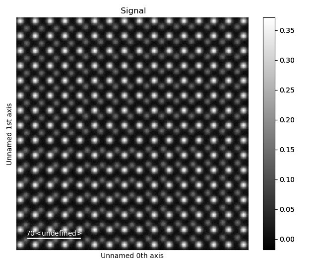
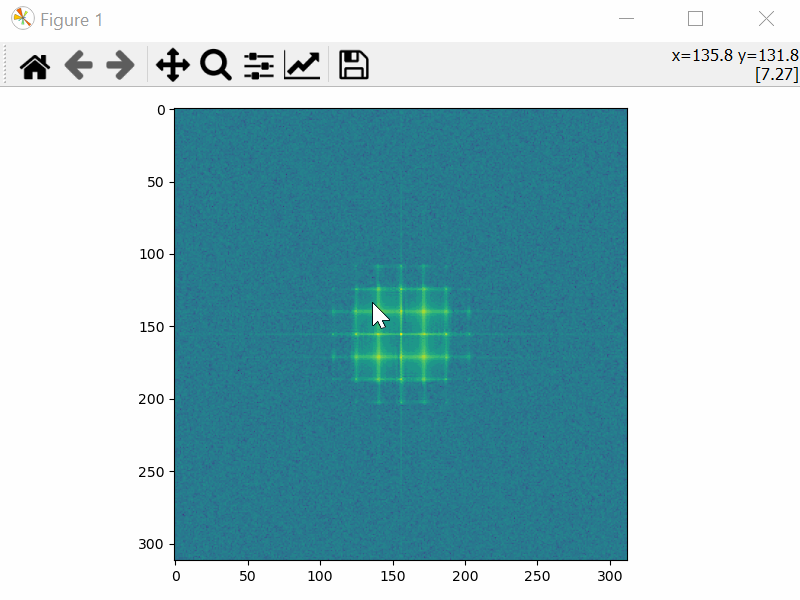
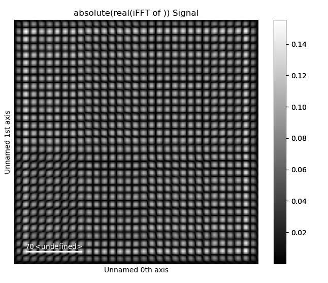
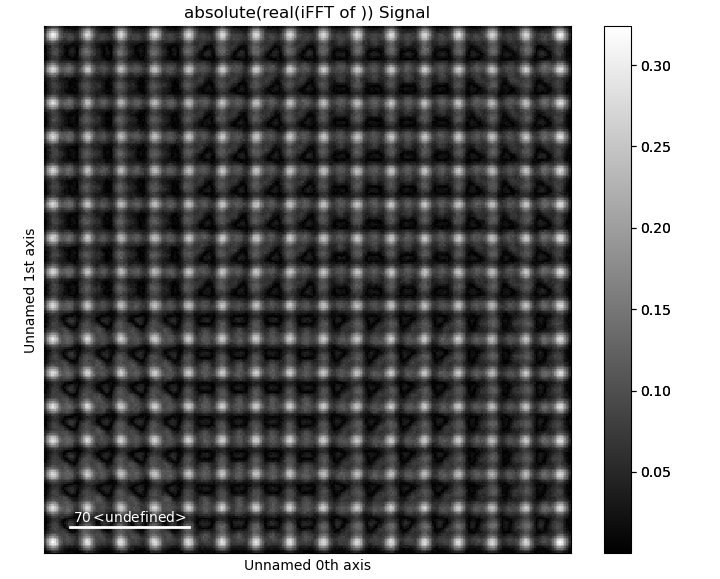
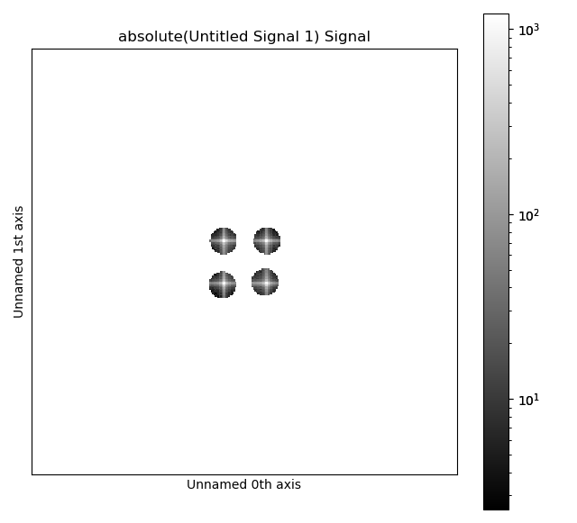

.. _masked_fft_tutorial:

.. include:: define_roles.rst

===================
Masked FFT and iFFT
===================

The :python:`temul.signal_processing` module allows one to choose the masking coordinates with
:python:`choose_mask_coordinates` and easily returnt the masked fast Fourier Transform (FFT) with
:python:`get_masked_ifft`. This can useful in various scenarios, from understanding
the diffraction space spots and how they relate to the real space structure,
to `revealing domain walls <https://onlinelibrary.wiley.com/doi/abs/10.1111/jmi.12876>`_
and finding initial atom positions for difficult images.

Load the Example Image
----------------------

.. code-block:: python

    >>> import temul.signal_processing as tmlsig
    >>> from temul.dummy_data import get_polarisation_dummy_dataset
    >>> atom_lattice = get_polarisation_dummy_dataset(image_noise=True)
    >>> image = atom_lattice.sublattice_list[0].signal
    >>> image.plot()

Choose the Mask Coordinates
---------------------------

.. code-block:: python

    >>> mask_coords = tmlsig.choose_mask_coordinates(image, norm="log")

Plot the Masked iFFT
--------------------

.. code-block:: python

    >>> mask_radius = 10  # pixels, default is also 10 pixels
    >>> image_ifft = tmlsig.get_masked_ifft(image, mask_coords, 
    ...                                     mask_radius=mask_radius)
    >>> image_ifft.plot()

Reverse the masking with `keep_masked_area=False`

.. code-block:: python

    >>> image_ifft = tmlsig.get_masked_ifft(image, mask_coords, 
    ...                                     keep_masked_area=False)
    >>> image_ifft.plot()

Plot the FFT with masks overlaid by using `plot_masked_fft=True`

.. code-block:: python

    >>> image_ifft = tmlsig.get_masked_ifft(image, mask_coords, 
    ...                                     plot_masked_fft=True)

If the input image is already a Fourier transform

.. code-block:: python

    >>> fft_image = image.fft(shift=True)  # Check out Hyperspy
    >>> image_ifft = tmlsig.get_masked_ifft(fft_image, mask_coords,
    ...                                     image_space='fourier')

Run FFT masking for Multiple Images
-----------------------------------

If you have multiple images, you can easily apply the mask to them all in a
simple :python:`for` loop. Of course, you can also save the images after plotting.

.. code-block:: python

    >>> from hyperspy.io import load
    >>> for file in files:
    ...     image = load(file)
    ...     image_ifft = tmlsig.get_masked_ifft(image, mask_coords)
    ...     image_ifft.plot()
