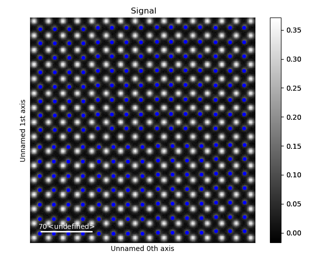
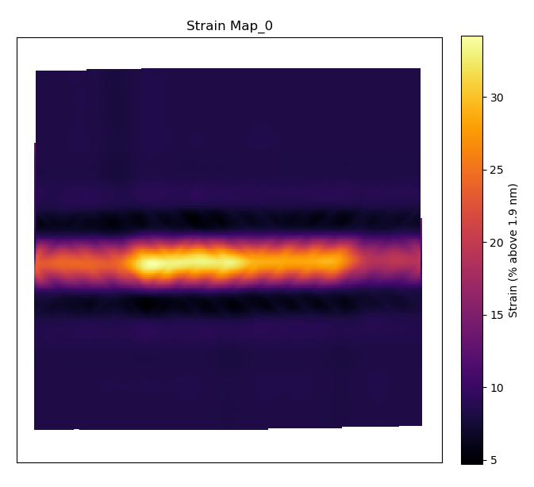
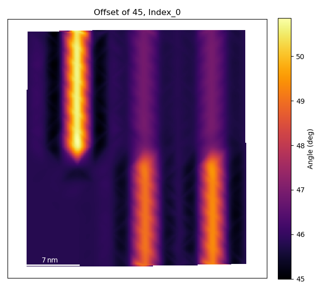
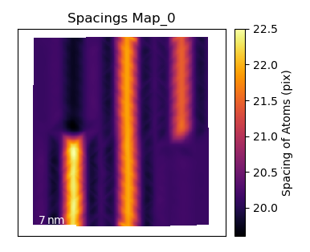
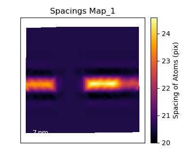
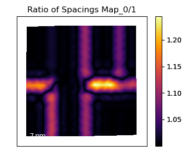

.. _structure_map_tutorial:

.. include:: define_roles.rst

===========================
Plot Lattice Structure Maps
===========================

The :python:`temul.polarisation` module allows one to easily visualise various
lattice structure characteristics, such as strain, rotation of atoms along atom
planes, and the *c*/*a* ratio in an atomic resolution image. In this tutorial,
we will use a dummy dataset to show the different ways each map can be created.
In future, tutorials on published experimental data will also be available.

Prepare and Plot the dummy dataset
----------------------------------

.. code-block:: python

    >>> import temul.polarisation as tmlp
    >>> from temul.dummy_data import get_polarisation_dummy_dataset
    >>> atom_lattice = get_polarisation_dummy_dataset(image_noise=True)
    >>> sublatticeA = atom_lattice.sublattice_list[0]
    >>> sublatticeB = atom_lattice.sublattice_list[1]
    >>> sublatticeA.construct_zone_axes()
    >>> sublatticeB.construct_zone_axes()
    >>> sampling = 0.1  # example of 0.1 nm/pix
    >>> units = 'nm'
    >>> sublatticeB.plot()

Plot the Lattice Strain Map
---------------------------

By inputting the calculated or theoretical atom plane separation distance as the
:python:`theoretical_value` parameter in :python:`tmlp.get_strain_map` below,
we can plot a strain map. The distance *l* is calculated as the distance between
each atom plane in the given zone axis. More details on this can be found on the
`Atomap <https://atomap.org/analysing_atom_lattices.html#distance-between-monolayers>`_
website.

.. code-block:: python
    
    >>> theor_val = 1.9
    >>> strain_map = tmlp.get_strain_map(sublatticeB, zone_axis_index=0,
    ...            units=units, sampling=sampling, theoretical_value=theor_val)

The outputted :python:`strain_map` is a Hyperspy Signal2D. To learn more what
can be done with Hyperspy, read their `documentation <https://hyperspy.org/hyperspy-doc/current/index.html>`_!

Setting the :python:`filename` parameter to any string will save the outputted plot
and the .hspy signal (Hyperspy's hdf5 format). This applies to all structure maps
discussed in this tutorial.

Setting :python:`return_x_y_z=False` will return the strain map along with the
x and y coordinates along with their corresponding strain values. One can then
use these values externally, e.g., create a matplotlib tricontour plot). This
applies to all structure maps discussed in this tutorial.

Plot the Lattice Atom Rotation Map
----------------------------------

The :python:`rotation_of_atom_planes` function calculates the angle between
successive atoms and the horizontal for all atoms in the given zone axis. See
`Atomap <https://atomap.org/analysing_atom_lattices.html#angle-between-atoms>`_
for other options.

.. code-block:: python

    >>> degrees=True
    >>> rotation_map = tmlp.rotation_of_atom_planes(sublatticeB, 0,
    ...                     units=units, sampling=sampling, degrees=degrees)

    '''
    Use `angle_offset` to effectively change the angle of the horizontal axis
    when calculating angles. Useful when the zone is not perfectly on the horizontal.
    '''

    >>> angle_offset = 45
    >>> rotation_map = tmlp.rotation_of_atom_planes(sublatticeB, 0,
    ...                     units=units, sampling=sampling, degrees=degrees,
    ...                     angle_offset=angle_offset, title='Offset of 45, Index')

Plot the *c*/*a* Ratio
----------------------

Using the :python:`ratio_of_lattice_spacings` function, we can visualise the ratio of
two sublattice zone axes. Useful for plotting the *c*/*a* Ratio.

.. code-block:: python

    >>> ratio_map = tmlp.ratio_of_lattice_spacings(sublatticeB, 0, 1,
    ...                 units=units, sampling=sampling)

One can also use :python:`ideal_ratio_one=False` to view the direction of tetragonality.
