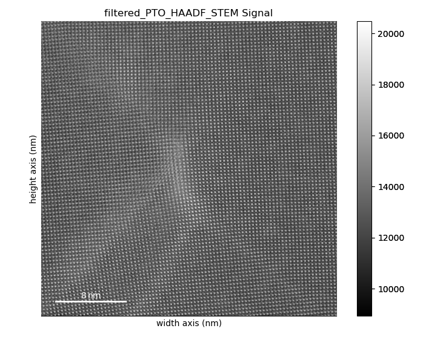
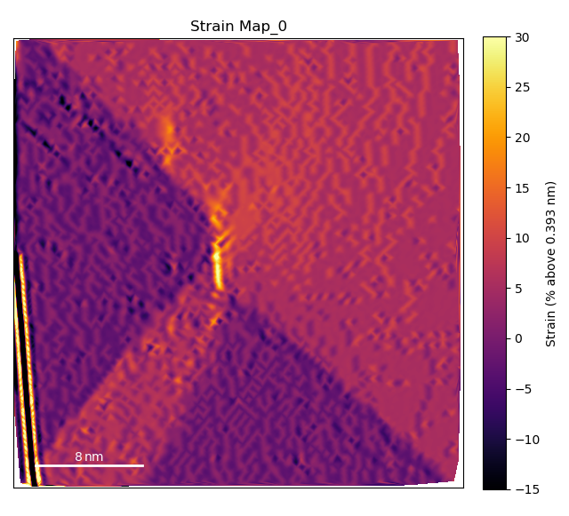
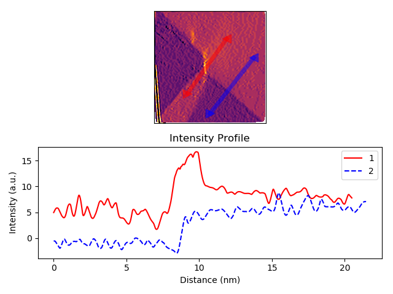
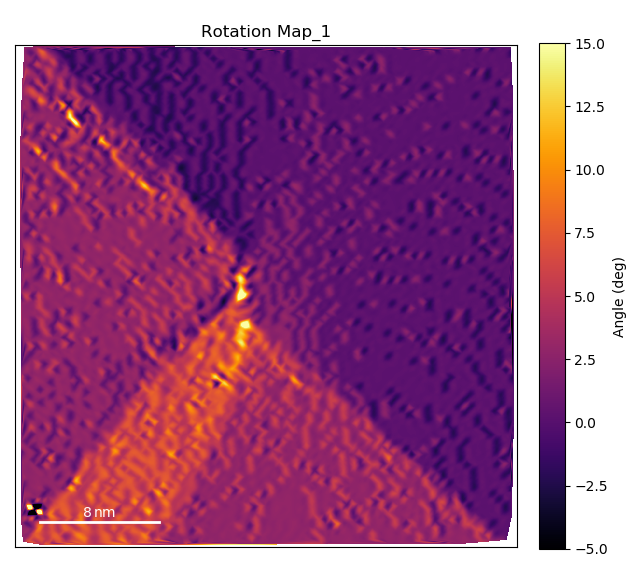
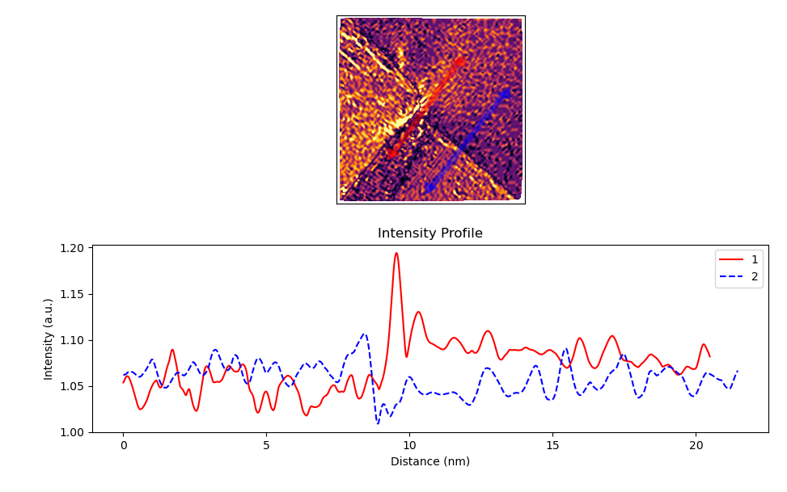
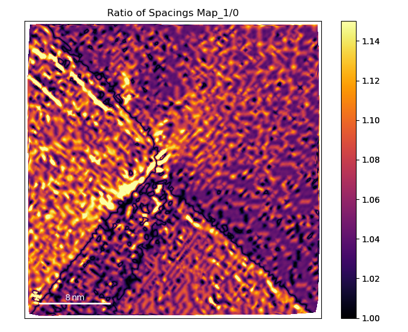
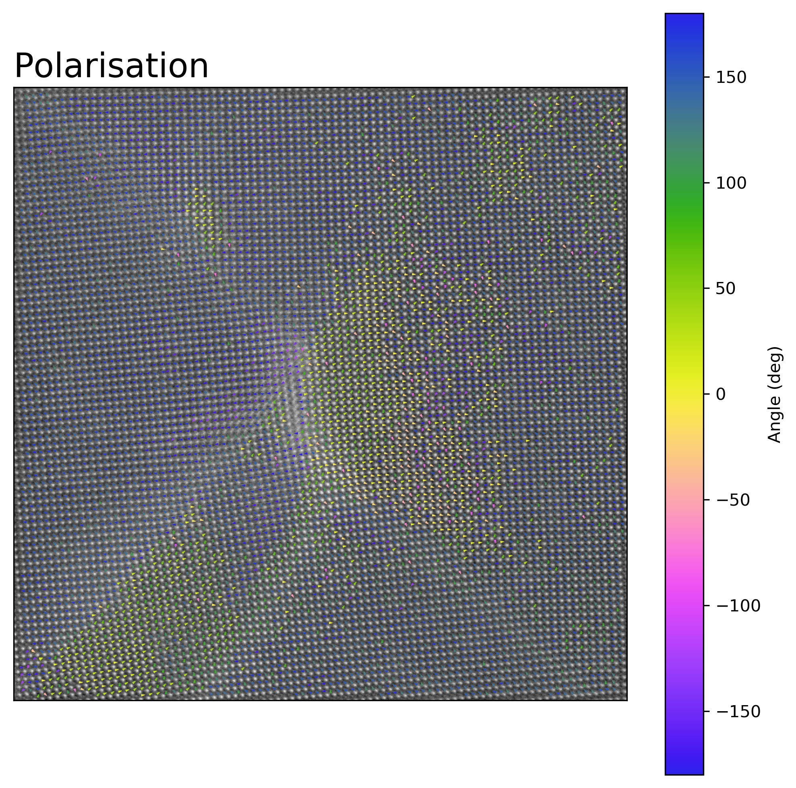

.. _PTO_Junction_moore:

.. include:: define_roles.rst

************************************
Analysis of PTO Domain Wall Junction
************************************

This tutorial follows the python scripts and jupyter notebooks found in the
"TEMUL/publication_examples/PTO_Junction_moore" folder in the
`TEMUL repository <https://github.com/PinkShnack/TEMUL>`_. The data and scripts
used below can be downloaded from there. Check out the publication:
K. Moore *et al* `Highly charged 180 degree head-to-head domain walls in lead titanate, Nature Communications Physics 2020
<https://www.nature.com/articles/s42005-020-00488-x>`_.

Use the notebook interactively now with MyBinder, just click the launch button below 
(There are some memory errors at the moment with the large .hdf5 files. It may work better 
if you run a Jupyter Notebook locally).

.. image:: https://mybinder.org/badge_logo.svg
    :target: https://mybinder.org/v2/gh/PinkShnack/TEMUL/master

Import the Modules and Load the Data
------------------------------------

.. code-block:: python

    >>> import temul.api as tml
    >>> import atomap.api as am
    >>> import hyperspy.api as hs
    >>> import numpy as np
    >>> import os
    >>> path_to_data = os.path.join(os.path.abspath(''), "publication_examples/PTO_Junction_moore/data") 
    >>> os.chdir(path_to_data)

Open the filtered PTO Junction dataset

.. code-block:: python

    >>> image = hs.load('filtered_PTO_HAADF_STEM.hspy')
    >>> sampling = image.axes_manager[-1].scale  # nm/pix
    >>> units = image.axes_manager[-1].units
    >>> image.plot()

Open the pre-made PTO-SRO atom lattice.

.. code-block:: python

    >>> atom_lattice = am.load_atom_lattice_from_hdf5("Atom_Lattice_crop.hdf5", False)
    >>> sublattice1 = atom_lattice.sublattice_list[0]  # Pb Sublattice
    >>> sublattice2 = atom_lattice.sublattice_list[1]  # Ti Sublattice
    >>> sublattice1.construct_zone_axes(atom_plane_tolerance=1)

Set up the Parameters
---------------------

Set up parameters for plotting the strain, rotation, and c/a ratio maps:
Note that sometimes the 0 and 1 axes are constructed first or second,
so you may have to swap them.

.. code-block:: python

    >>> zone_vector_index_A = 0
    >>> zone_vector_index_B = 1
    >>> filename = None  # Set to a string if you want to save the map

Note: You can use :python:`return_x_y_z=True` for each of the map functions below
to get the raw x,y, and strain/rotation/ratio values for further plotting with
matplotlib! `Check the documentation <temul-toolkit.readthedocs.io>`_

Load the line profile positions:

.. code-block:: python

    >>> line_profile_positions = np.load('line_profile_positions.npy')

Note: You can also choose your own line_profile_positions with
:py:func:`temul.topotem.fft_mapping.choose_points_on_image` and use the
:python:`skimage.profile_line` for customisability.

Create the Lattice Strain Map
-----------------------------

We want to see the strain map of the Pb Sublattice in the y-axis direction
Note that sometimes the 0 and 1 axes directions are constructed vice versa.

.. code-block:: python

    >>> vmin = -15
    >>> vmax = 30
    >>> cmap = 'inferno'
    >>> theoretical_value = round(3.929/10, 3)  # units of nm
    >>> strain_map = tml.get_strain_map(sublattice1, zone_vector_index_B,
    ...                          theoretical_value, sampling=sampling,
    ...                          units=units, vmin=vmin, vmax=vmax, cmap=cmap)

Plot the line profiles with :py:mod:`temul.signal_plotting` functions and a kwarg dictionary.
For more details on this function, see :ref:`this tutorial <line_profile_tutorial>`.

.. code-block:: python

    >>> kwargs = {'vmin': vmin, 'vmax': vmax, 'cmap': cmap}
    >>> tml.compare_images_line_profile_one_image(strain_map, line_profile_positions,
    ...                               linewidth=100, arrow='h', linetrace=0.05,
    ...                               **kwargs)

Create the Lattice Rotation Map
-------------------------------

Now plot the rotation map of the Pb Sublattice in the x-axis direction to see
the turning of the lattice across the junction.

.. code-block:: python

    >>> vmin = -5
    >>> vmax = 15
    >>> cmap = 'inferno'
    >>> angle_offset = -2  # degrees
    >>> rotation_map = tml.rotation_of_atom_planes(
    ...                     sublattice1, zone_vector_index_A, units=units,
    ...                     angle_offset, degrees=True, sampling=sampling,
    ...                     vmin=vmin, vmax=vmax, cmap=cmap)

Plot the line profiles with :py:mod:`temul.signal_plotting` functions and a kwarg dictionary.
For more details on this function, see :ref:`this tutorial <line_profile_tutorial>`.

.. code-block:: python

    >>> kwargs = {'vmin': vmin, 'vmax': vmax, 'cmap': cmap}
    >>> tml.compare_images_line_profile_one_image(
    ...     rotation_map, line_profile_positions, linewidth=100, arrow='h',
    ...     linetrace=0.05, **kwargs)

Create the Lattice c/a Ratio Map
--------------------------------

Now plot the c/a ratio map of the Pb Sublattice

.. code-block:: python

    >>> vmin = 1
    >>> vmax = 1.15
    >>> cmap = 'inferno'
    >>> ideal_ratio_one = True  # values under 1 will be divided by themselves
    >>> ca_ratio_map = tml.ratio_of_lattice_spacings(
    ...                    sublattice1, zone_vector_index_B,
    ...                    zone_vector_index_A, ideal_ratio_one, sampling=sampling,
    ...                    units=units, vmin=vmin, vmax=vmax, cmap=cmap)

.. code-block:: python

    >>> kwargs = {'vmin': vmin, 'vmax': vmax, 'cmap': cmap}
    >>> tml.compare_images_line_profile_one_image(
    ...     ca_ratio_map, line_profile_positions, linewidth=100, arrow='h',
    ...     linetrace=0.05, **kwargs)

Map the Polarisation
--------------------
In this case, the PTO structure near the junction is highly strained.
Therefore, we can't use the the Atomap
get_polarization_from_second_sublattice function.

.. code-block:: python

    >>> atom_positions_actual = np.array(
    ...     [sublattice2.x_position, sublattice2.y_position]).T
    >>> atom_positions_ideal = np.load('atom_positions_orig_2.npy')
    >>> u, v = tml.find_polarisation_vectors(
    ...     atom_positions_actual, atom_positions_ideal)
    >>> x, y = atom_positions_actual.T.tolist()

Plot the polarisation vectors (zoom in to get a better look, the top left is
off zone).

.. code-block:: python

    >>> tml.plot_polarisation_vectors(
    ...     x=x, y=y, u=u, v=v, image=image.data,
    ...     sampling=sampling, units=units, unit_vector=False, overlay=True,
    ...     color='yellow', plot_style='vector', title='Polarisation',
    ...     monitor_dpi=250, save=None)

.. image:: ../publication_examples/PTO_Junction_moore/data/Polarisation_magnitude_vector.png
    :scale: 25 %

Plot the angle information as a colorwheel

.. code-block:: python

    >>> plt.style.use("grayscale")
    >>> tml.plot_polarisation_vectors(
    ...     x=x, y=y, u=u, v=v, image=image.data, save=None,
    ...     sampling=sampling, units=units, unit_vector=True, overlay=True,
    ...     color='yellow', plot_style='colorwheel', title='Polarisation',
    ...     monitor_dpi=250, vector_rep='angle', degrees=True)

