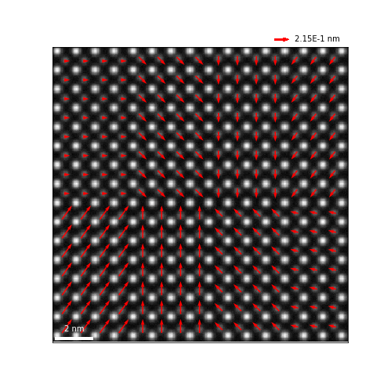
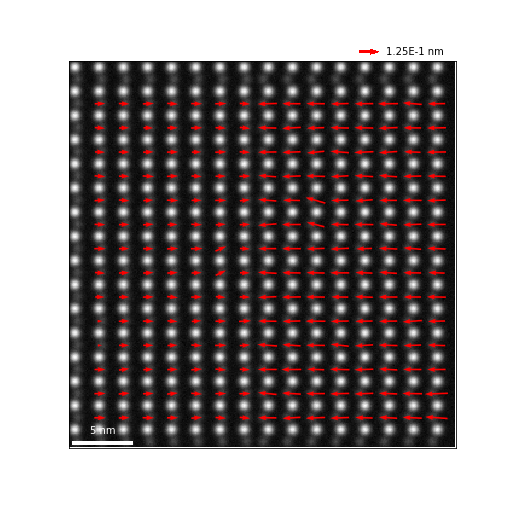
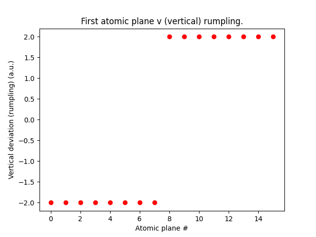
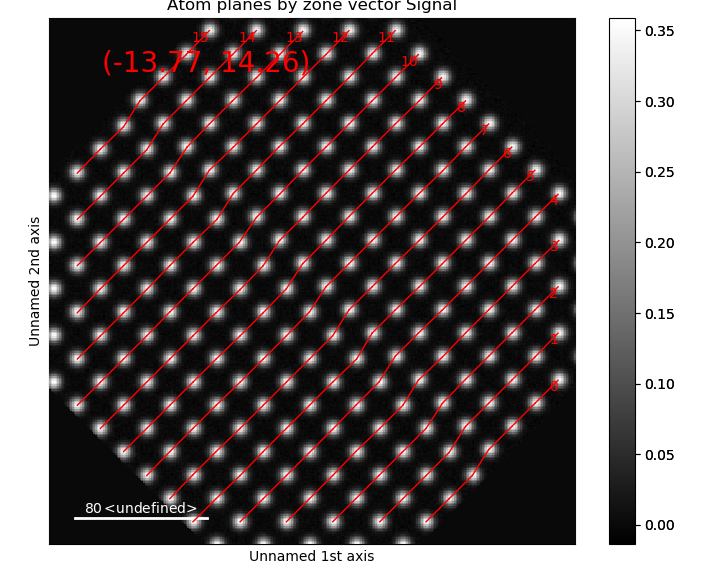
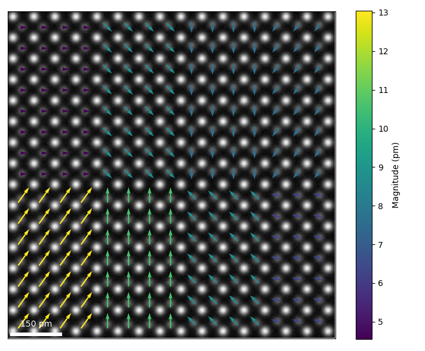
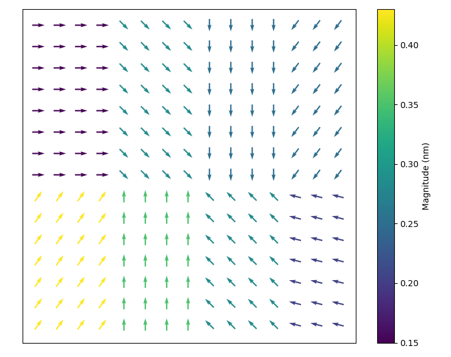
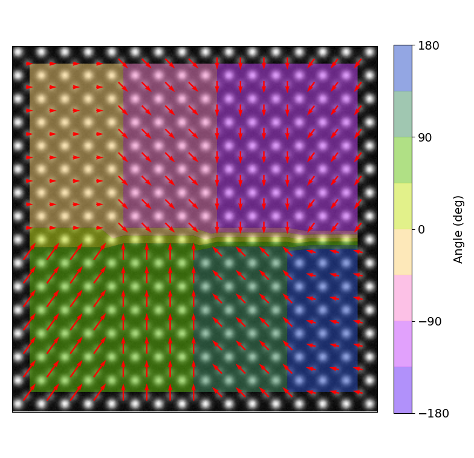
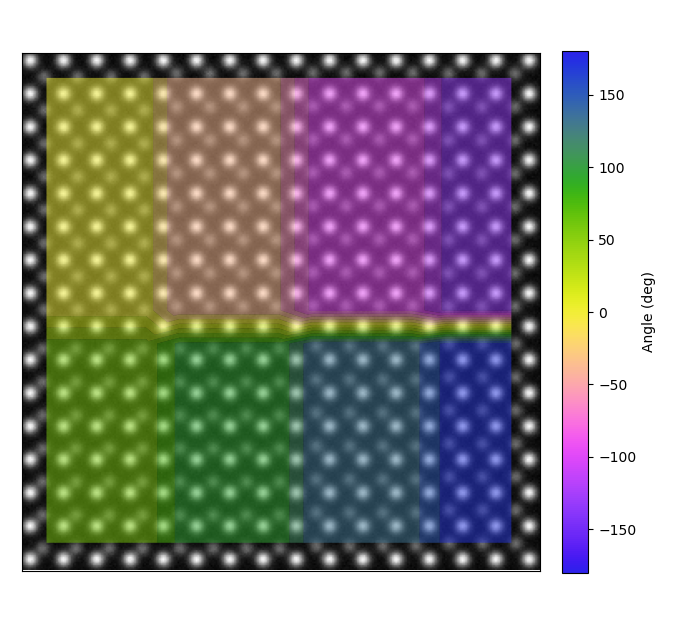

.. _polarisation_vectors_tutorial:

.. include:: define_roles.rst

============================
Finding Polarisation Vectors
============================

There are several methods available in the TEMUL Toolkit and
`Atomap <https://atomap.org/>`_ packages for finding polarisation vectors in
atomic resolution images. These are briefly described here, followed by a use-case
of each. 

Current functions:

1. Using Atomap's `get_polarization_from_second_sublattice <https://atomap.org/api_documentation.html?highlight=get_polarization#atomap.sublattice.Sublattice.get_polarization_from_second_sublattice>`_
   Sublattice method. Great for "standard" polarised structures with two sublattices.
2. Using the TEMUL :py:func:`temul.topotem.polarisation.find_polarisation_vectors`
   function. Useful for structures that Atomap's
   :python:`get_polarization_from_second_sublattice` can't handle.
3. Using the TEMUL :py:func:`temul.topotem.polarisation.atom_deviation_from_straight_line_fit`
   function. Useful for calculating polarisation from a single sublattice, similar to and
   based off: J. Gonnissen *et al*, Direct Observation of Ferroelectric Domain Walls in
   LiNbO3: Wall‐Meanders, Kinks, and Local Electric Charges, 26, 42, 2016, DOI: 10.1002/adfm.201603489.

These methods are also available as python scripts and jupyter notebooks in the 
`TEMUL repository <https://github.com/PinkShnack/TEMUL>`_ in the 
"code_tutorials/workflows" folder. You can interact with the workflows without needing any downloads.
Just click the button below and navigate to that same folder,
where you will find the python scripts and interactive python notebooks:

.. image:: https://mybinder.org/badge_logo.svg
    :target: https://mybinder.org/v2/gh/PinkShnack/TEMUL/master

For standard Polarised Structures (e.g., PTO)
---------------------------------------------
Atomap's `get_polarization_from_second_sublattice <https://atomap.org/api_documentation.html?highlight=get_polarization#atomap.sublattice.Sublattice.get_polarization_from_second_sublattice>`_
Sublattice method will
be sufficent for most users when dealing with the classic PTO-style polarisation,
wherein the atoms in a sublattice are polarised with respect to a second sublattice.

See the second section of this tutorial on how to plot this in many different ways
using :py:func:`temul.topotem.polarisation.plot_polarisation_vectors`!

.. code-block:: python

    >>> import temul.api as tml
    >>> from temul.dummy_data import get_polarisation_dummy_dataset
    >>> atom_lattice = get_polarisation_dummy_dataset(image_noise=True)
    >>> sublatticeA = atom_lattice.sublattice_list[0]
    >>> sublatticeB = atom_lattice.sublattice_list[1]
    >>> sublatticeA.construct_zone_axes()
    >>> za0, za1 = sublatticeA.zones_axis_average_distances[0:2]
    >>> s_p = sublatticeA.get_polarization_from_second_sublattice(
    ...     za0, za1, sublatticeB)
    >>> vector_list = s_p.metadata.vector_list
    >>> x, y = [i[0] for i in vector_list], [i[1] for i in vector_list]
    >>> u, v = [i[2] for i in vector_list], [i[3] for i in vector_list]
    >>> sampling, units =  0.05, 'nm'
    >>> tml.plot_polarisation_vectors(x, y, u, v, image=atom_lattice.image,
    ...                           sampling=sampling, units=units,
    ...                           unit_vector=False, save=None, scalebar=True,
    ...                           plot_style='vector', color='r',
    ...                           overlay=True, monitor_dpi=45)

For nonstandard Polarised Structures (e.g., Boracites)
------------------------------------------------------
When the above function can't isn't suitable, the TEMUL
:py:func:`temul.topotem.polarisation.find_polarisation_vectors` function may
be an option. It is useful for structures that Atomap's
:python:`get_polarization_from_second_sublattice` can't
handle. It is a little more involved and requires some extra preparation when 
creating the sublattices. 

See the second section of this tutorial on how to plot this in many different ways
using :py:func:`temul.topotem.polarisation.plot_polarisation_vectors`!

.. code-block:: python

    >>> import temul.api as tml
    >>> import atomap.api as am
    >>> import numpy as np
    >>> from temul.dummy_data import get_polarisation_dummy_dataset_bora
    >>> signal = get_polarisation_dummy_dataset_bora(True).signal
    >>> atom_positions = am.get_atom_positions(signal, separation=7)
    >>> sublatticeA = am.Sublattice(atom_positions, image=signal.data)
    >>> sublatticeA.find_nearest_neighbors()
    >>> sublatticeA.refine_atom_positions_using_center_of_mass()
    >>> sublatticeA.construct_zone_axes()
    >>> zone_axis_001 = sublatticeA.zones_axis_average_distances[0]
    >>> atom_positions2 = sublatticeA.find_missing_atoms_from_zone_vector(
    ...     zone_axis_001, vector_fraction=0.5)
    >>> sublatticeB = am.Sublattice(atom_positions2, image=signal.data,
    ...                             color='blue')
    >>> sublatticeB.find_nearest_neighbors()
    >>> sublatticeB.refine_atom_positions_using_center_of_mass(percent_to_nn=0.2)
    >>> atom_positions2_refined = np.array([sublatticeB.x_position,
    ...                                     sublatticeB.y_position]).T
    >>> atom_positions2 = np.asarray(atom_positions2).T

We then use the original (ideal) positions "atom_positions2" and the refined
positions "atom_positions2_refined" to calculate and visualise the
polarisation in the structure. Don't forget to save these arrays for further use!

.. code-block:: python

    >>> u, v = tml.find_polarisation_vectors(atom_positions2,
    ...                                      atom_positions2_refined)
    >>> x, y = sublatticeB.x_position.tolist(), sublatticeB.y_position.tolist()
    >>> sampling, units =  0.1, 'nm'
    >>> tml.plot_polarisation_vectors(x, y, u, v, image=signal.data,
    ...                         sampling=sampling, units=units, scalebar=True,
    ...                         unit_vector=False, save=None,
    ...                         plot_style='vector', color='r',
    ...                         overlay=True, monitor_dpi=45)

For single Polarised Sublattices (e.g., LNO)
--------------------------------------------
When dealing with structures in which the polarisation must be extracted from a
single sublattice (one type of chemical atomic column, the TEMUL
:py:func:`temul.topotem.polarisation.atom_deviation_from_straight_line_fit` function
may be an option. It is based off the description by J. Gonnissen *et al*,
Direct Observation of Ferroelectric Domain Walls in LiNbO3: Wall‐Meanders,
Kinks, and Local Electric Charges, 26, 42, 2016, DOI: 10.1002/adfm.201603489.

See the second section of this tutorial on how to plot this in many different ways
using :py:func:`temul.topotem.polarisation.plot_polarisation_vectors`!

.. code-block:: python

    >>> import temul.api as tml
    >>> import temul.dummy_data as dd
    >>> sublattice = dd.get_polarised_single_sublattice()
    >>> sublattice.construct_zone_axes(atom_plane_tolerance=1)
    >>> sublattice.plot_planes()
    
    Choose `n`: how many atom columns should be used to fit the line on each
    side of the atom planes. If `n` is too large, the fitting will appear
    incorrect.

    >>> n = 5
    >>> x, y, u, v = tml.atom_deviation_from_straight_line_fit(
    ...     sublattice, 0, n)
    >>> tml.plot_polarisation_vectors(x, y, u, v, image=sublattice.image,
    ...                               unit_vector=False, save=None,
    ...                               plot_style='vector', color='r',
    ...                               overlay=True, monitor_dpi=50)

.. image:: tutorial_images/polarisation_vectors_tutorial/deviation_zone_0.png
    :scale: 45 %
.. image:: tutorial_images/polarisation_vectors_tutorial/deviation_vectors_polar_dd.png
    :scale: 70 %

We can look at individual atomic column information by using
``return_individual_atom_planes = True``.

.. code-block:: python

    >>> return_individual_atom_planes = True
    >>> x, y, u, v = tml.atom_deviation_from_straight_line_fit(
    ...     sublattice, axis_number=0, n=5, second_fit_rigid=True, plot=False,
    ...     return_individual_atom_planes=return_individual_atom_planes)

    To look at first atomic plane rumpling

    >>> plt.figure()
    >>> plt.plot(range(len(v[0])), v[0], 'ro')
    >>> plt.title("First atomic plane v (vertical) rumpling.")
    >>> plt.xlabel("Atomic plane #")
    >>> plt.ylabel("Vertical deviation (rumpling) (a.u.)")
    >>> plt.show()

    We could also of course use a numpy array to handle the data.

    >>> arr = np.array([x, y, u, v]).T

Let's look at some rotated data

.. code-block:: python

    >>> sublattice = dd.get_polarised_single_sublattice_rotated(
    ...     image_noise=True, rotation=45)
    >>> sublattice.construct_zone_axes(atom_plane_tolerance=0.9)
    >>> sublattice.plot_planes()
    >>> n = 3  # plot the sublattice to see why 3 is suitable here!
    >>> x, y, u, v = tml.atom_deviation_from_straight_line_fit(
    ...     sublattice, 0, n)
    >>> tml.plot_polarisation_vectors(x, y, u, v, image=sublattice.image,
    ...                       vector_rep='angle', save=None, degrees=True,
    ...                       plot_style='colormap', cmap='cet_coolwarm',
    ...                       overlay=True, monitor_dpi=50)

.. image:: tutorial_images/polarisation_vectors_tutorial/deviation_vectors_polar_dd_rot.png
    :scale: 45 %

==========================================
Plotting Polarisation and Movement Vectors
==========================================

The :py:mod:`temul.topotem.polarisation` module allows one to visualise the
polarisation/movement of atoms in an atomic resolution image. In this tutorial,
we will use a dummy dataset to show the different ways the
:py:func:`temul.topotem.polarisation.plot_polarisation_vectors`
function can display data. In future, tutorials on published experimental data
will also be available.

To go through the below examples in a live Jupyter Notebook session, click the button below
and choose "code_tutorials/polarisation_vectors_tutorial.ipynb" (it may take a few minutes to load). 

.. image:: https://mybinder.org/badge_logo.svg
   :target: https://mybinder.org/v2/gh/PinkShnack/TEMUL/master

Prepare and Plot the dummy dataset
----------------------------------

.. code-block:: python

    >>> import temul.api as tml
    >>> from temul.dummy_data import get_polarisation_dummy_dataset
    >>> atom_lattice = get_polarisation_dummy_dataset(image_noise=True)
    >>> sublatticeA = atom_lattice.sublattice_list[0]
    >>> sublatticeB = atom_lattice.sublattice_list[1]
    >>> image = sublatticeA.signal
    >>> image.plot()

.. image:: tutorial_images/polarisation_vectors_tutorial/image_uncalibrated.png
    :scale: 60 %

It is best when the image is calibrated. Your image may already be calibrated,
but if not, use Hyperspy's :python:`axes_manager` for calibration.

.. code-block:: python

    >>> sampling = 0.1  # example of 0.1 nm/pix
    >>> units = 'nm'
    >>> image.axes_manager[-1].scale = sampling
    >>> image.axes_manager[-2].scale = sampling
    >>> image.axes_manager[-1].units = units
    >>> image.axes_manager[-2].units = units
    >>> image.plot()

.. image:: tutorial_images/polarisation_vectors_tutorial/image_calibrated.png
    :scale: 60 %

Zoom in on the image to see how the atoms look in the different regions.

.. image:: tutorial_images/polarisation_vectors_tutorial/image_calibrated_labelled_atoms.png
    :scale: 55 %

Find the Vector Coordinates using Atomap
----------------------------------------

Using the `Atomap <https://atomap.org/>`_ package, we can easily get the
polarisation vectors for regular structures.

    >>> sublatticeA.construct_zone_axes()
    >>> za0, za1 = sublatticeA.zones_axis_average_distances[0:2]
    >>> s_p = sublatticeA.get_polarization_from_second_sublattice(
    ...     za0, za1, sublatticeB, color='blue')
    >>> vector_list = s_p.metadata.vector_list
    >>> x, y = [i[0] for i in vector_list], [i[1] for i in vector_list]
    >>> u, v = [i[2] for i in vector_list], [i[3] for i in vector_list]

Now we can display all of the variations that
:py:func:`temul.topotem.polarisation.plot_polarisation_vectors`
gives us! You can specify sampling (scale) and units, or use a calibrated image
so that they are automatically set.

Vector magnitude plot with red arrows:

.. code-block:: python

    >>> tml.plot_polarisation_vectors(x, y, u, v, image=image,
    ...                           unit_vector=False, save=None,
    ...                           plot_style='vector', color='r',
    ...                           overlay=False, title='Vector Arrows',
    ...                           monitor_dpi=50)

.. image:: tutorial_images/polarisation_vectors_tutorial/vectors_red.png
    :scale: 60 %

Vector magnitude plot with red arrows overlaid on the image, no title:

.. code-block:: python

    >>> tml.plot_polarisation_vectors(x, y, u, v, image=image,
    ...                           unit_vector=False, save=None,
    ...                           plot_style='vector', color='r',
    ...                           overlay=True, monitor_dpi=50)

.. image:: tutorial_images/polarisation_vectors_tutorial/vectors_red_overlay.png
    :scale: 60 %

Vector magnitude plot with colormap viridis:

.. code-block:: python

    >>> tml.plot_polarisation_vectors(x, y, u, v, image=image,
    ...                           unit_vector=False, save=None,
    ...                           plot_style='colormap', monitor_dpi=50,
    ...                           overlay=False, cmap='viridis')

.. image:: tutorial_images/polarisation_vectors_tutorial/colormap_magnitude.png
    :scale: 60 %

Vector angle plot with colormap viridis (:python:`vector_rep='angle'`):

.. code-block:: python

    >>> tml.plot_polarisation_vectors(x, y, u, v, image=image,
    ...                           unit_vector=False, save=None,
    ...                           plot_style='colormap', monitor_dpi=50,
    ...                           overlay=False, cmap='cet_colorwheel',
    ...                           vector_rep="angle", degrees=True)

.. image:: tutorial_images/polarisation_vectors_tutorial/colormap_angle.png
    :scale: 60 %

Colormap arrows with sampling specified in the parameters and with scalebar:

.. code-block:: python

    >>> tml.plot_polarisation_vectors(x, y, u, v, image=sublatticeA.image,
    ...                           sampling=3.0321, units='pm', monitor_dpi=50,
    ...                           unit_vector=False, plot_style='colormap',
    ...                           overlay=True, save=None, cmap='viridis',
    ...                           scalebar=True)

Vector plot with colormap viridis and unit vectors:

.. code-block:: python

    >>> tml.plot_polarisation_vectors(x, y, u, v, image=image,
    ...                           unit_vector=True, save=None, monitor_dpi=50,
    ...                           plot_style='colormap', color='r',
    ...                           overlay=False, cmap='viridis')

Change the vectors to unit vectors on a Matplotlib tricontourf map:

.. code-block:: python

    >>> tml.plot_polarisation_vectors(x, y, u, v, image=image, unit_vector=True,
    ...                           plot_style='contour', overlay=False,
    ...                           pivot='middle', save=None, monitor_dpi=50,
    ...                           color='darkgray', cmap='viridis')

.. image:: tutorial_images/polarisation_vectors_tutorial/contour_magnitude_unitvectors.png
    :scale: 60 %

Plot a partly transparent angle tricontourf map with specified colorbar ticks
and vector arrows:

.. code-block:: python

    >>> tml.plot_polarisation_vectors(x, y, u, v, image=image,
    ...                           unit_vector=False, plot_style='contour',
    ...                           overlay=True, pivot='middle', save=None,
    ...                           color='red', cmap='cet_colorwheel',
    ...                           monitor_dpi=50, remove_vectors=False,
    ...                           vector_rep="angle", alpha=0.5, levels=9,
    ...                           antialiased=True, degrees=True,
    ...                           ticks=[180, 90, 0, -90, -180])

Plot a partly transparent angle tricontourf map with no vector arrows:

.. code-block:: python

    >>> tml.plot_polarisation_vectors(x, y, u, v, image=image, remove_vectors=True,
    ...                           unit_vector=True, plot_style='contour',
    ...                           overlay=True, pivot='middle', save=None,
    ...                           cmap='cet_colorwheel', alpha=0.5,
    ...                           monitor_dpi=50, vector_rep="angle",
    ...                           antialiased=True, degrees=True)

"colorwheel" plot of the vectors, useful for visualising vortexes:

.. code-block:: python

    >>> import colorcet as cc  # can also just use cmap="cet_colorwheel"
    >>> tml.plot_polarisation_vectors(x, y, u, v, image=image,
    ...                           unit_vector=True, plot_style="colorwheel",
    ...                           vector_rep="angle",
    ...                           overlay=False, cmap=cc.cm.colorwheel,
    ...                           degrees=True, save=None, monitor_dpi=50)

.. image:: tutorial_images/polarisation_vectors_tutorial/colorwheel_angle.png
    :scale: 70 %

"polar_colorwheel" plot showing a 2D polar color wheel, also useful for vortexes:

.. code-block:: python

    >>> tml.plot_polarisation_vectors(x, y, u, v, image=image,
    ...                           plot_style="polar_colorwheel",
    ...                           unit_vector=False, overlay=False,
    ...                           save=None, monitor_dpi=50)

    # This plot may show the effect of the second dimension more clearly.
    # Example taken from Matplotlib's Quiver documentation.
    >>> import numpy as np
    >>> X, Y = np.meshgrid(np.arange(0, 2 * np.pi, .2), np.arange(0, 2 * np.pi, .2))
    >>> image_temp = np.ones_like(X)
    >>> U = np.reshape(np.cos(X), 1024)
    >>> V = np.reshape(np.sin(Y), 1024)
    >>> X, Y = np.reshape(X, 1024), np.reshape(Y, 1024)
    >>> ax = tml.plot_polarisation_vectors(X, Y, U, -V, image=image_temp,
    ...                           plot_style="polar_colorwheel",
    ...                           overlay=False, invert_y_axis=False,
    ...                           save=None, monitor_dpi=None)
    >>> ax.invert_yaxis()

.. image:: tutorial_images/polarisation_vectors_tutorial/colorwheel_polar.png
    :scale: 70 %

.. image:: tutorial_images/polarisation_vectors_tutorial/quiver_2d_colorwheel.png
    :scale: 55 %

Plot with a custom scalebar. In this example, we need it to be dark, see
matplotlib-scalebar for more custom features.

.. code-block:: python

    >>> scbar_dict = {"dx": 3.0321, "units": "pm", "location": "lower left",
    ...               "box_alpha":0.0, "color": "black", "scale_loc": "top"}
    >>> tml.plot_polarisation_vectors(x, y, u, v, image=sublatticeA.image,
    ...                           sampling=3.0321, units='pm', monitor_dpi=50,
    ...                           unit_vector=False, plot_style='colormap',
    ...                           overlay=False, save=None, cmap='viridis',
    ...                           scalebar=scbar_dict)

.. image:: tutorial_images/polarisation_vectors_tutorial/colormap_magnitude_custom_sb.png
    :scale: 60 %

Plot a tricontourf for quadrant visualisation using a custom matplotlib cmap:

.. code-block:: python

    >>> import temul.api as tml
    >>> from matplotlib.colors import from_levels_and_colors
    >>> zest = tml.hex_to_rgb(tml.color_palettes('zesty'))
    >>> zest.append(zest[0])  # make the -180 and 180 degree colour the same
    >>> expanded_zest = tml.expand_palette(zest, [1,2,2,2,1])
    >>> custom_cmap, from_levels_and_colors(
    ...     levels=range(9), colors=tml.rgb_to_dec(expanded_zest))
    >>> tml.plot_polarisation_vectors(x, y, u, v, image=image,
    ...                           unit_vector=False, plot_style='contour',
    ...                           overlay=False, pivot='middle', save=None,
    ...                           cmap=custom_cmap, levels=9, monitor_dpi=50,
    ...                           vector_rep="angle", alpha=0.5, color='r',
    ...                           antialiased=True, degrees=True,
    ...                           ticks=[180, 90, 0, -90, -180])

.. image:: tutorial_images/polarisation_vectors_tutorial/contour_angle_custom_cmap_vectors.png
    :scale: 60 %
